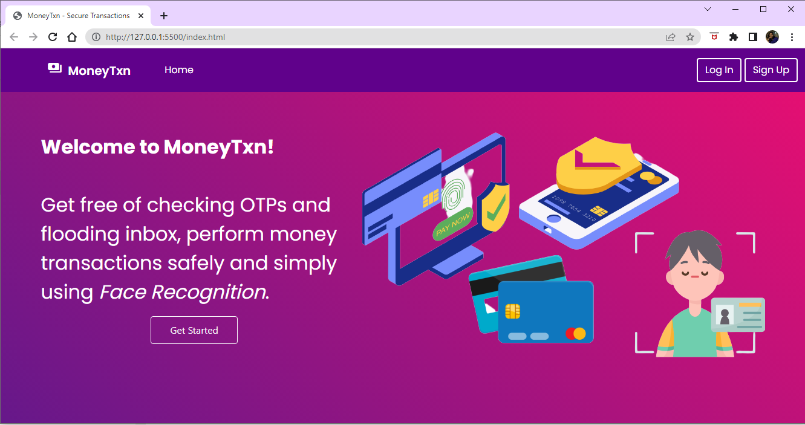
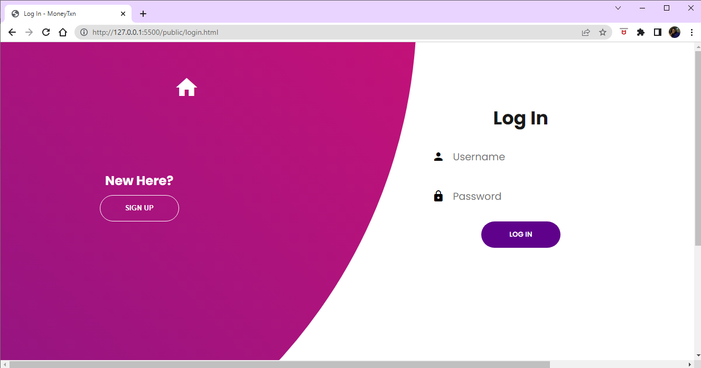
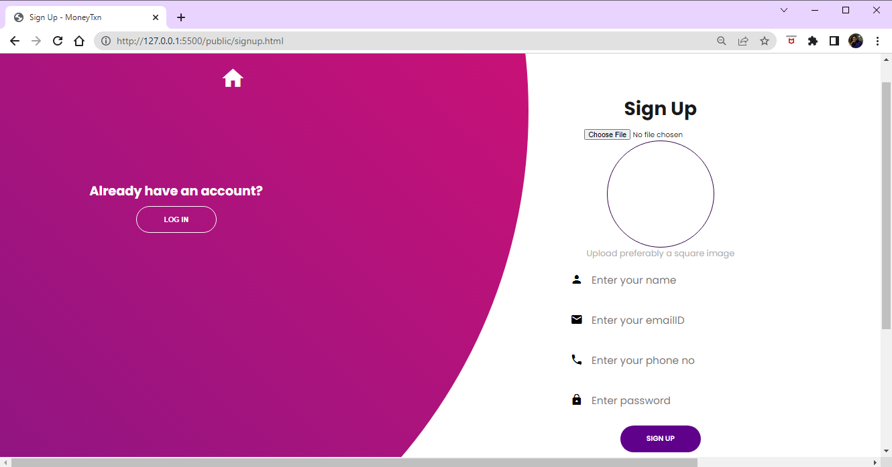
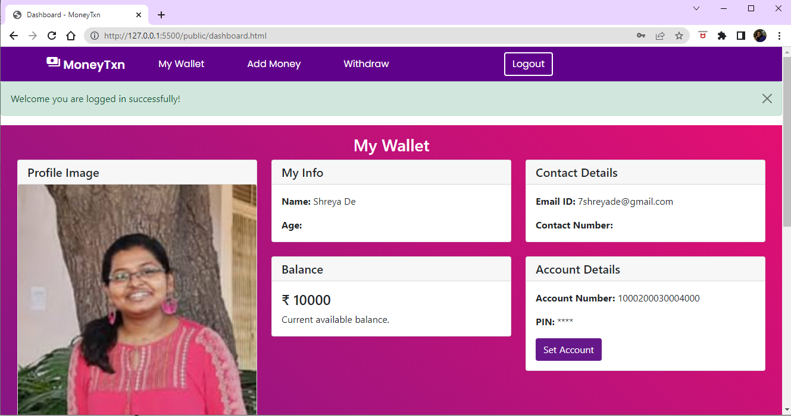
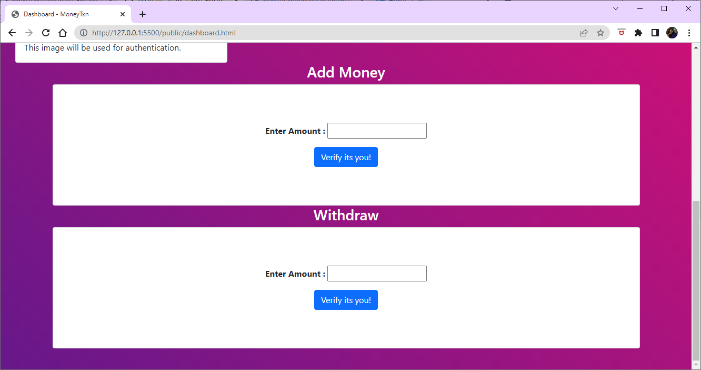
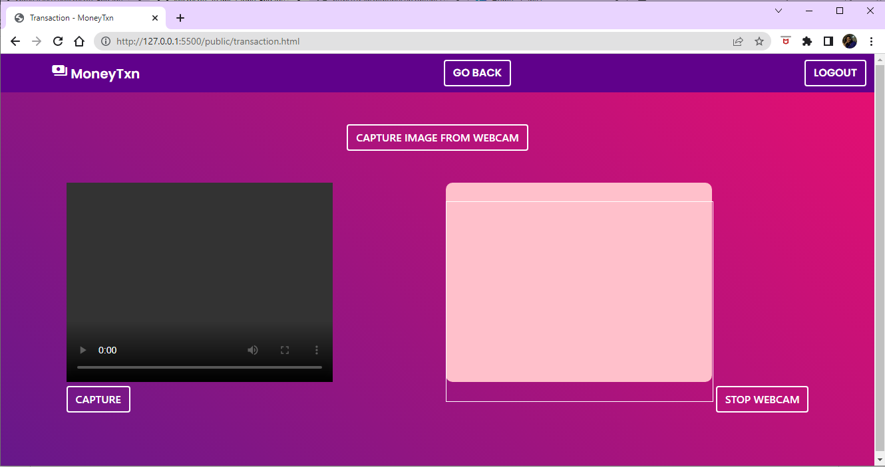
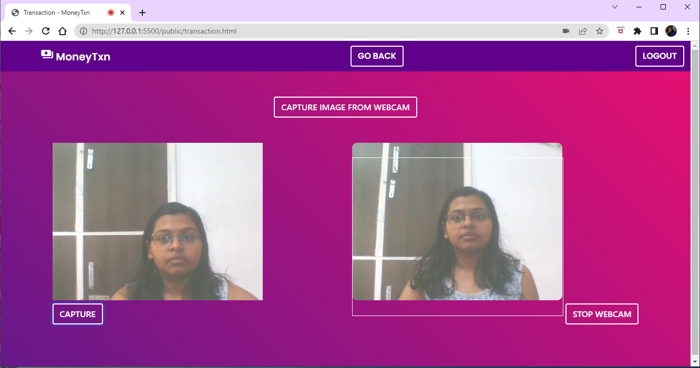
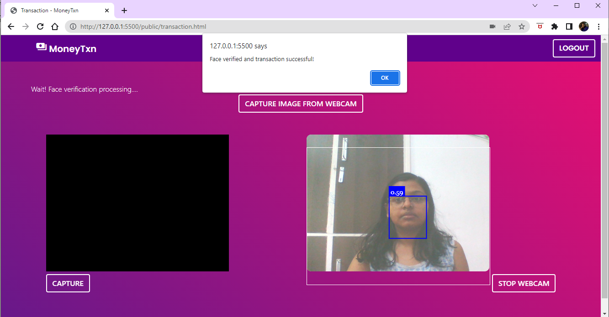

<h1 align="center">Microsoft-Engage-2022-Face-Recognition-MoneyTxn</h1>

MoneyTxn is a browser-based web application developed for Microsoft Engage 2022. As a part of the program, the mentees were asked to choose anyone of the three challenges assigned to them.
MoneyTxn demonstrates the application of Face Recognition to facilitate secure transactions.

## Table of contents
- [Technology Stack](#technology-stack)
- [Navigating through the web application](#Navigating-through-the-web-application)
- [Resources Used](#resources-used)

## Technology Stack

      

        
        
        
        
        
        
      
 

 

- HTML5, CSS3 and Bootstrap5 were used to develop the user interface.
- Javascript was used to add functionalities and make the face recognition feature using the [face-api.js](https://github.com/justadudewhohacks/face-api.js).
- Firebase was used for the database.
 

## Navigating through the web application
1. <h3>Homepage</h3>
This is the first page after the user opens the web application. It has options to either login or signup and begin with the transaction process.

2. <h3>LogIn<h3>
The LogIn feature is connected with the Firebase Authentication and allows existing users to enter their username and password to get into their dashboard.

3. <h3>SignUp<h3>
The SignUp feature is also setup using the Firebase Authentication and allows new users to make their account in the application by uploading their image which will be used for transaction verification. Users will have to enter their name, emailID and setup a password.

4. <h3>Dashboard</h3>
After successful login, the user enters the dashboard which shows their profile picture, name, emailID, and current account balance.  
As this is a prototype the default balance is set to ₹10000 and the account number and pin are set to default values. 
The user can now add or withdraw money from their wallet. The add and withdraw options are executed only after successful verification.

5. <h3>Transaction</h3>
After clicking on verify option the user is redirected to transactions page, where face verification takes place.

 

Click on the "CAPTURE IMAGE FROM WEBCAM" option to start the webcam and click on the "CAPTURE" button to capture image. Ensure the face is clearly visible.

 

Click on the "STOP WEBCAM" option to upload the captured image and run face verification.  
The face in the captured image is matched with the profile image uploaded earlier to verify the user. This is done using the [face-api.js] which runs in the background.
If the face is not detected, a "no face detected" warning is generated and the authorised user is required to again capture their image with their face clearly visible.
If the face is matched, then a message of successful face verification and transaction is generated and the transaction is completed.
If the face is not matched, then the transaction is failed. 
 

6. <h3>Transaction successful</h3>
If the face is verified successfully, the transaction completes and the current account balance is updated.

## Resources Used
- [Multiple Face Detection and Recognition System Design Applying Deep Learning in Web Browsers using JavaScript - Cristhian Gabriel Espinosa Sandoval](https://scholarworks.uark.edu/cgi/viewcontent.cgi?article=1073&context=csceuht)
- [face-api.js](https://github.com/justadudewhohacks/face-api.js)
- [A Complete Firebase Email/Password Authentication For Web Apps](https://youtu.be/gcmGNOj37E8) 
- [Firebase Realtime Database For Web Tutorial - Client Side](https://youtu.be/2CtQEXwOPXw)